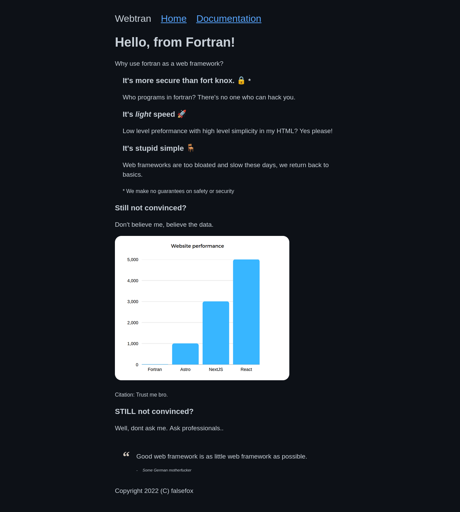

# Fortran.JS Web framework
The best web framework for human-driven websites. 

## Features
- Blazingly fast speeds 🚀🚀🚀. Fortran.JS is compiled to machine code and executed on demand. 
- Simplicity 🪑 Web frameworks have become too bloated and slow, Fortran.JS breathes a sigh of relief to overworked developers looking for yet another new framework.
- Security by obscurity 🔒 Hackers and bad actors don't even know fortran, so how are they going to cause data breaches?

## Custom web server
The custom web server is written in Node.JS, and has custom developer tools, such as:
- A dev server with automatic building and reloading on changes 🚀🚀🚀
- A smart compiler that handles everything for you, like compiler options for components. 🚀🚀🚀
- Support for external files in a /public/ directory 🚀🚀🚀
- Supports components like in less advanced frameworks like react 🚀🚀🚀


## Code example:
```fortran
! webapp.f90
program home
   implicit none

   character(len=*), parameter :: Head = '<!doctype html>' //&
    '<html lang="en">' //&
    '<body>'
   print '(a)', Head

   character(len=*), parameter :: some_dynamic_text = 'Hello, from Fortran!'
   print '(a)', '<h1>', some_dynamic_text, '</h1>'

   print '(a)', '</body></html>'
end program home
```

## Demo 
The repository comes with, by default, an advanced demo featuring components and dynamic text in action.



## Prereqs
- linux computer (no spawn-fcgi on windows)
- [spawn-fcgi](https://github.com/lighttpd/spawn-fcgi) (build from source or install from package manager)
- nodejs and npm
- the [fortran language](https://fortran-lang.org/learn/os_setup/install_gfortran/)

## Install
1. Don't
2. Install spawn-fcgi, nodejs and fortran for your system
3. Use "npm run dev" to run a development server that'll auto rebuild
4. Use "npm run build" to build the server
5. Use "npm run start" to run the server.

## Yes this is satire!
I made this as a joke a year or two ago. I am still ashamed.

## Works cited:
[1] *Observation of Einstein-Podolsky-Rosen Entanglement on Supraquantum Structures by Induction Through Nonlinear Transuranic Crystal of Extremely Long Wavelength (ELW) Pulse from Mode-Locked Source Array* (Freeman, Gordon 1992)

[2] 

